Plot Smarttester’s sensor data for the ISEA use-wear project
================
Ivan Calandra
2025-01-06 15:45:10 CET

- [Goal of the script](#goal-of-the-script)
- [Load packages](#load-packages)
- [Read in Rbin file](#read-in-rbin-file)
- [Plot](#plot)
  - [Define variables](#define-variables)
  - [Subset and prepare data for
    plots](#subset-and-prepare-data-for-plots)
    - [Every 20th strokes](#every-20th-strokes)
    - [First 50 positive (odd) strokes](#first-50-positive-odd-strokes)
  - [Prepare receiving lists](#prepare-receiving-lists)
  - [Plots](#plots)
    - [Every 20th stroke](#every-20th-stroke)
    - [First 50 strokes](#first-50-strokes)
- [sessionInfo()](#sessioninfo)
- [Cite R packages used](#cite-r-packages-used)
  - [References](#references)

------------------------------------------------------------------------

# Goal of the script

This script plots the sensors data from the Smarttester.

``` r
dir_in <- "analysis/derived_data/"
dir_plots <- "analysis/plots/"
```

Input CSV file file must be located in “./analysis/derived_data/”.  
Plots will be saved in “./analysis/plots/”.

The knit directory for this script is the project directory.

------------------------------------------------------------------------

# Load packages

``` r
library(ggplot2)
library(grateful)
library(gridExtra)
library(knitr)
library(R.utils)
library(rmarkdown)
library(tidyverse)
library(viridis)
```

------------------------------------------------------------------------

# Read in Rbin file

``` r
ST_file <- list.files(dir_in, pattern = "Smarttester\\.Rbin$", full.names = TRUE)
ST_data <- loadObject(ST_file)
str(ST_data)
```

    'data.frame':   114195 obs. of  10 variables:
     $ Sample           : chr  "ISEA-EX1" "ISEA-EX1" "ISEA-EX1" "ISEA-EX1" ...
     $ File             : num  0 0 0 0 0 0 0 0 0 0 ...
     $ Bamboo_position  : Factor w/ 5 levels "0","-7.5","-15",..: 1 1 1 1 1 1 1 1 1 1 ...
     $ Step             : int  0 100000 200000 300000 400000 500000 600000 700000 800000 900000 ...
     $ StrokeNr         : num  1 1 1 1 1 1 2 2 2 2 ...
     $ Angle [°]        : num  0.000884 -0.016282 -0.589631 -0.811417 -0.699494 ...
     $ Depth [mm]       : num  10.15 10.15 9.92 9.36 9.23 ...
     $ Torque [Nm]      : num  1.4 1.6 4.9 5.7 6.3 7 8.2 -3.9 -2.7 -4.2 ...
     $ X_position [mm]  : num  275 275 279 284 285 ...
     $ X_velocity [mm/s]: num  0.00187 9.88465 59.21647 31.58108 0.39584 ...

``` r
head(ST_data)
```

        Sample File Bamboo_position   Step StrokeNr     Angle [°] Depth [mm]
    1 ISEA-EX1    0               0      0        1  0.0008842885  10.151439
    2 ISEA-EX1    0               0 100000        1 -0.0162818470  10.146061
    3 ISEA-EX1    0               0 200000        1 -0.5896308000   9.922504
    4 ISEA-EX1    0               0 300000        1 -0.8114173000   9.362462
    5 ISEA-EX1    0               0 400000        1 -0.6994940600   9.229558
    6 ISEA-EX1    0               0 500000        1 -0.6383826000   9.255678
      Torque [Nm] X_position [mm] X_velocity [mm/s]
    1         1.4        275.0000       0.001873783
    2         1.6        275.1974       9.884645000
    3         4.9        279.2093      59.216473000
    4         5.7        284.2325      31.581081000
    5         6.3        284.9546       0.395838140
    6         7.0        284.9808       0.040469542

------------------------------------------------------------------------

# Plot

## Define variables

Define dependent (numeric) variables to plot on the Y axis

``` r
# Y-axis
ST_y <- c("X_velocity [mm/s]", "Depth [mm]", "Angle [°]", "Torque [Nm]")

# X-axis
X_name <- grep("X_position", names(ST_data), value = TRUE)
X_name_leg <- gsub("_", " ", X_name)
```

## Subset and prepare data for plots

For readability, only every 20th stroke will be plotted. The first 50
strokes going along the positive X axis (i.e. odd strokes from 1 to 100)
will also be plotted separately.

### Every 20th strokes

``` r
# Create a sequence of every 20th strokes, including first and before last strokes
# Before last is necessary because of bidirectional strokes:
# the odd strokes go in one X direction, while the even strokes go in the other
stroke_20 <- seq(1, 2000, by = 20) %>% 
             c(max(ST_data$StrokeNr) - 1) 

# Extract data for these strokes
data_every20 <- filter(ST_data, StrokeNr %in% stroke_20) %>% 

                # Pivot to longer format for facet plots
                pivot_longer(all_of(ST_y), names_to = "parameter", values_to = "value") %>% 
  
                # Convert to data.frame
                as.data.frame()

# Check result
str(data_every20)
```

    'data.frame':   24232 obs. of  8 variables:
     $ Sample         : chr  "ISEA-EX1" "ISEA-EX1" "ISEA-EX1" "ISEA-EX1" ...
     $ File           : num  0 0 0 0 0 0 0 0 0 0 ...
     $ Bamboo_position: Factor w/ 5 levels "0","-7.5","-15",..: 1 1 1 1 1 1 1 1 1 1 ...
     $ Step           : int  0 0 0 0 100000 100000 100000 100000 200000 200000 ...
     $ StrokeNr       : num  1 1 1 1 1 1 1 1 1 1 ...
     $ X_position [mm]: num  275 275 275 275 275 ...
     $ parameter      : chr  "X_velocity [mm/s]" "Depth [mm]" "Angle [°]" "Torque [Nm]" ...
     $ value          : num  1.87e-03 1.02e+01 8.84e-04 1.40 9.88 ...

``` r
head(data_every20)
```

        Sample File Bamboo_position   Step StrokeNr X_position [mm]
    1 ISEA-EX1    0               0      0        1        275.0000
    2 ISEA-EX1    0               0      0        1        275.0000
    3 ISEA-EX1    0               0      0        1        275.0000
    4 ISEA-EX1    0               0      0        1        275.0000
    5 ISEA-EX1    0               0 100000        1        275.1974
    6 ISEA-EX1    0               0 100000        1        275.1974
              parameter        value
    1 X_velocity [mm/s] 1.873783e-03
    2        Depth [mm] 1.015144e+01
    3         Angle [°] 8.842885e-04
    4       Torque [Nm] 1.400000e+00
    5 X_velocity [mm/s] 9.884645e+00
    6        Depth [mm] 1.014606e+01

### First 50 positive (odd) strokes

``` r
# Extract data for the first 50 odd strokes
data_1to50 <- filter(ST_data, StrokeNr %in% seq(1, 100, 2)) %>% 

              # Pivot to longer format for facet plots
              pivot_longer(all_of(ST_y), names_to = "parameter", values_to = "value") %>% 
  
              # Convert to data.frame
              as.data.frame()

# Check result
str(data_1to50)
```

    'data.frame':   10500 obs. of  8 variables:
     $ Sample         : chr  "ISEA-EX1" "ISEA-EX1" "ISEA-EX1" "ISEA-EX1" ...
     $ File           : num  0 0 0 0 0 0 0 0 0 0 ...
     $ Bamboo_position: Factor w/ 5 levels "0","-7.5","-15",..: 1 1 1 1 1 1 1 1 1 1 ...
     $ Step           : int  0 0 0 0 100000 100000 100000 100000 200000 200000 ...
     $ StrokeNr       : num  1 1 1 1 1 1 1 1 1 1 ...
     $ X_position [mm]: num  275 275 275 275 275 ...
     $ parameter      : chr  "X_velocity [mm/s]" "Depth [mm]" "Angle [°]" "Torque [Nm]" ...
     $ value          : num  1.87e-03 1.02e+01 8.84e-04 1.40 9.88 ...

``` r
head(data_1to50)
```

        Sample File Bamboo_position   Step StrokeNr X_position [mm]
    1 ISEA-EX1    0               0      0        1        275.0000
    2 ISEA-EX1    0               0      0        1        275.0000
    3 ISEA-EX1    0               0      0        1        275.0000
    4 ISEA-EX1    0               0      0        1        275.0000
    5 ISEA-EX1    0               0 100000        1        275.1974
    6 ISEA-EX1    0               0 100000        1        275.1974
              parameter        value
    1 X_velocity [mm/s] 1.873783e-03
    2        Depth [mm] 1.015144e+01
    3         Angle [°] 8.842885e-04
    4       Torque [Nm] 1.400000e+00
    5 X_velocity [mm/s] 9.884645e+00
    6        Depth [mm] 1.014606e+01

## Prepare receiving lists

Data for the first 400 strokes of sample ISEA-EX3 were not recorded, so
the first 50 positive strokes cannot be plotted for that sample.

``` r
# Sample IDs
sample_ID <- levels(factor(ST_data$Sample)) %>% 
             data.frame(Sample = ., SampleNr = .) %>% 
             mutate(SampleNr = as.numeric(gsub("ISEA-EX", "", SampleNr))) %>% 
             arrange(SampleNr)

# Create lists to receive the plots
p_every20 <- p_1to50 <- vector(mode = "list", length = nrow(sample_ID))
names(p_every20) <- names(p_1to50) <- sample_ID$Sample

# Delete ISEA-EX3 from p_1to50
p_1to50[["ISEA-EX3"]] <- NULL
```

## Plots

### Every 20th stroke

``` r
# Plot for every sample
for (i in names(p_every20)) {
  
  # Filter data per sample
  data_every20_i <- filter(data_every20, Sample == i)
  
                    # Prepare plot
  p_every20[[i]] <- ggplot(data = data_every20_i, 
                           aes(x = .data[[X_name]], y = value, color = StrokeNr)) + 
  
                    # Draw one line per stroke
                    geom_line(aes(group = StrokeNr), alpha = 0.7, linewidth = 0.4) +
  
                    # Facet plot by 'parameter' (= 'ST_y')
                    facet_wrap(~ parameter, scales = "free_y") +
  
                    # The palette 'viridis' is printer- and colorblind-friendly, and perceptually uniform
                    scale_color_viridis(trans = "reverse") + 
  
                    # Light theme, and remove x-axis text and ticks
                    theme_classic() + 
                    
                    # No y-axis label and title from sample_ID$Sample
                    labs(y = NULL, title = i, x = X_name_leg)
}

# Print list of plots
print(p_every20)
```

    $`ISEA-EX1`

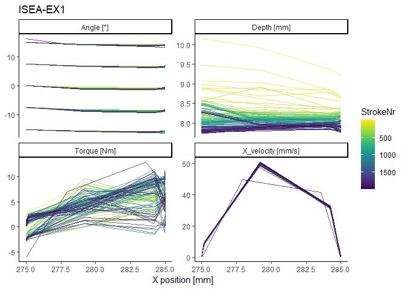<!-- -->


    $`ISEA-EX2`

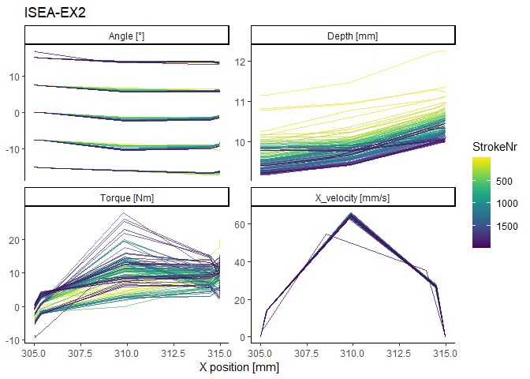<!-- -->


    $`ISEA-EX3`

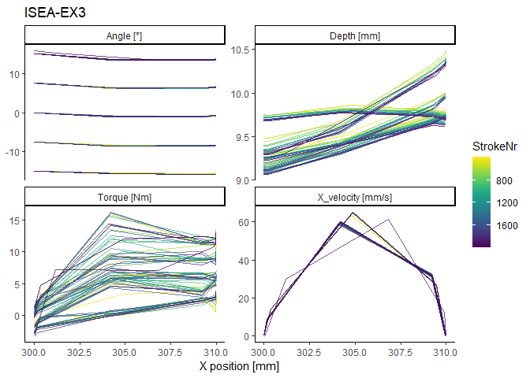<!-- -->


    $`ISEA-EX4`

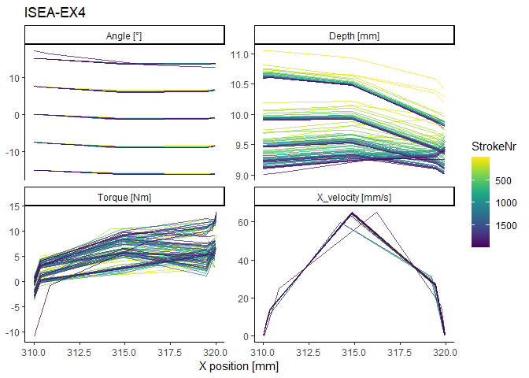<!-- -->


    $`ISEA-EX5`

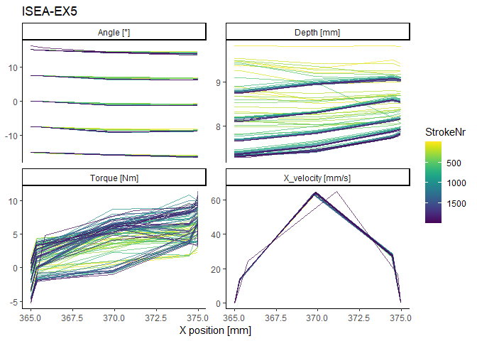<!-- -->


    $`ISEA-EX6`

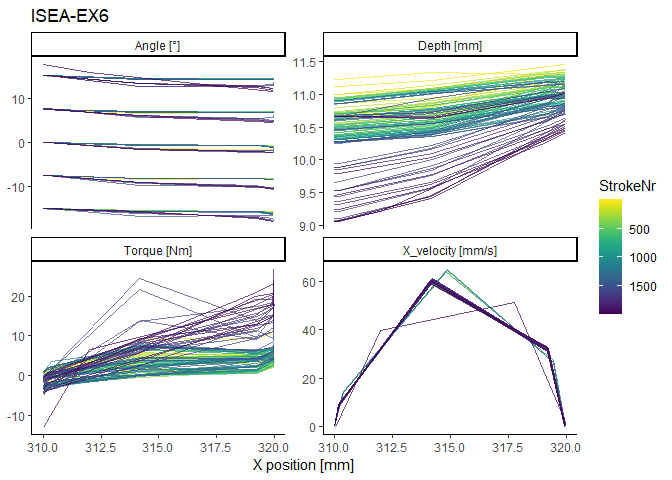<!-- -->


    $`ISEA-EX7`

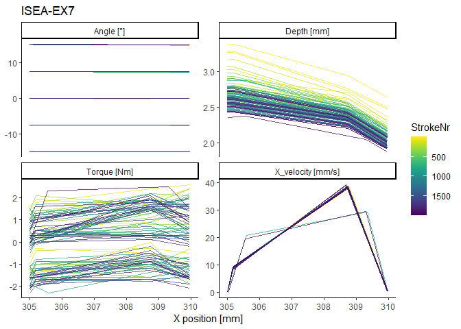<!-- -->


    $`ISEA-EX8`

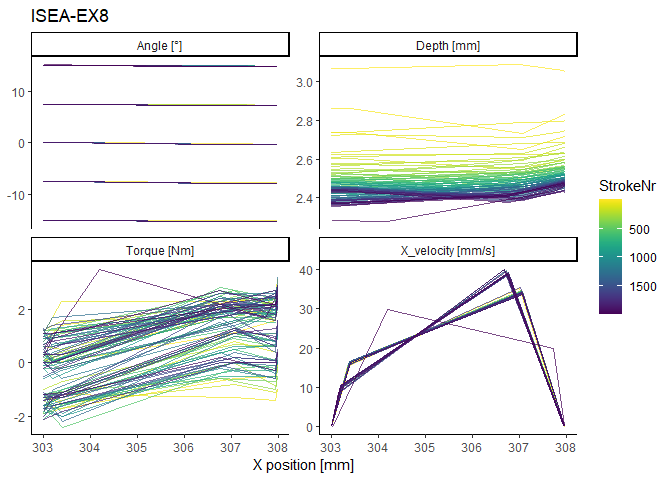<!-- -->


    $`ISEA-EX9`

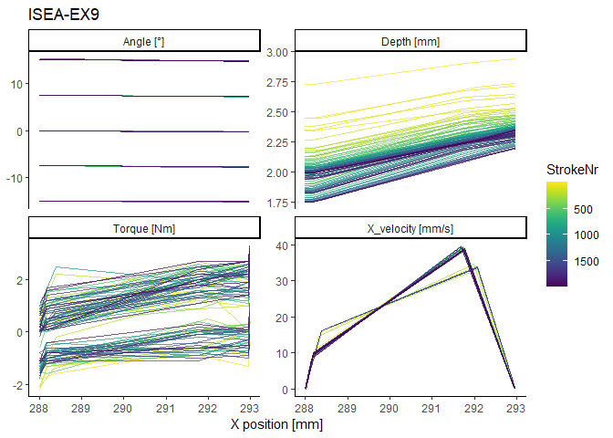<!-- -->


    $`ISEA-EX10`

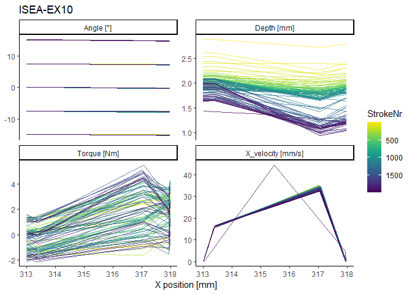<!-- -->


    $`ISEA-EX11`

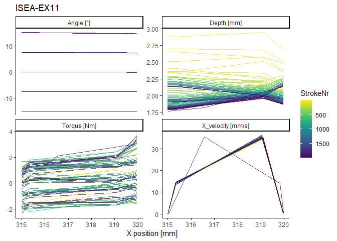<!-- -->


    $`ISEA-EX12`

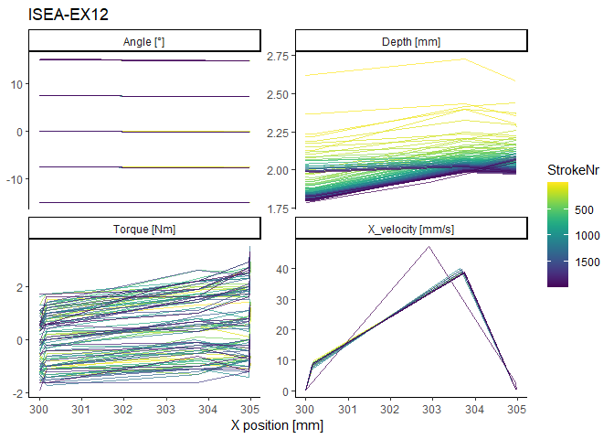<!-- -->

``` r
# Save list of plots
ggsave(filename = "ISEA_use-wear_Smarttester-plots_all-strokes.pdf", 
       path = dir_plots, width = 190, units = "mm", 
       plot = marrangeGrob(p_every20, nrow = 1, ncol = 1, top = NULL))
```

### First 50 strokes

Data for the first 400 strokes of sample ISEA-EX3 were not recorded, so
the first 50 positive strokes cannot be plotted for that sample.

``` r
# Plot for every sample
for (i in names(p_1to50)) {
  
  # Filter data per sample
  data_1to50_i <- filter(data_1to50, Sample == i)
  
                  # Prepare plot
  p_1to50[[i]] <- ggplot(data = data_1to50_i, 
                         aes(x = .data[[X_name]], y = value, color = StrokeNr)) + 
  
                  # Draw one line per stroke
                  geom_line(aes(group = StrokeNr), alpha = 0.7, linewidth = 0.4) +
  
                  # Facet plot by 'parameter' (= 'ST_y')
                  facet_wrap(~ parameter, scales = "free_y") +
  
                  # The palette 'viridis' is printer- and colorblind-friendly, and perceptually uniform
                  scale_color_viridis(trans = "reverse") + 
  
                  # Light theme, and remove x-axis text and ticks
                  theme_classic() + 
                    
                  # No y-axis label and title from sample_ID$Sample
                  labs(y = NULL, title = i, x = X_name_leg)
}

# Print list of plots
print(p_1to50)
```

    $`ISEA-EX1`

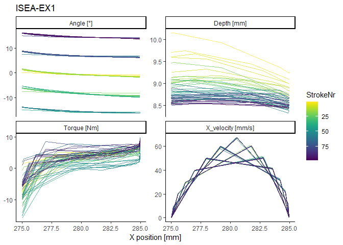<!-- -->


    $`ISEA-EX2`

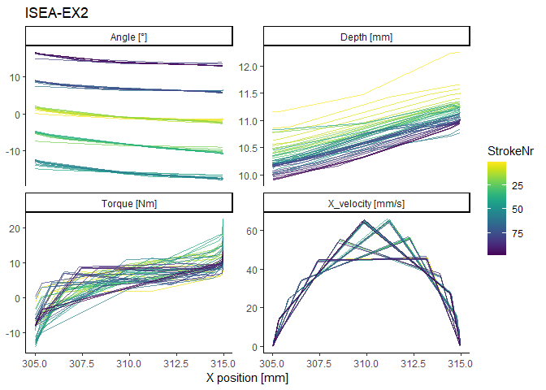<!-- -->


    $`ISEA-EX4`

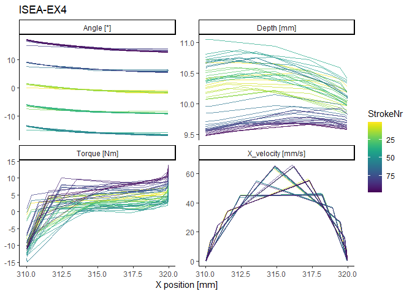<!-- -->


    $`ISEA-EX5`

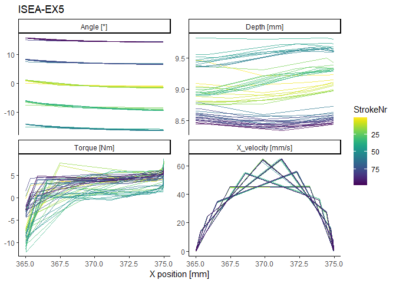<!-- -->


    $`ISEA-EX6`

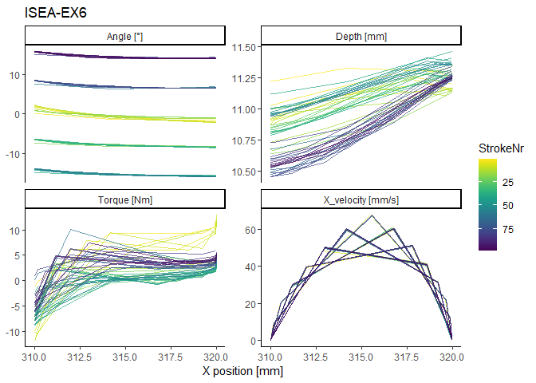<!-- -->


    $`ISEA-EX7`

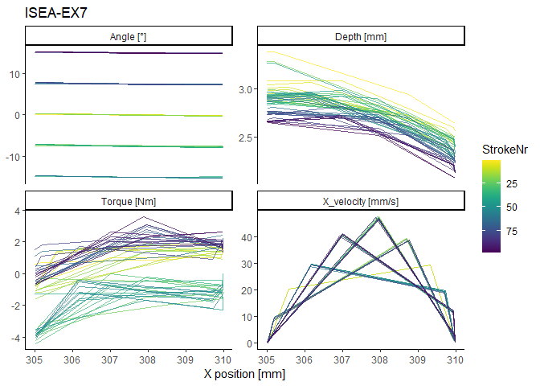<!-- -->


    $`ISEA-EX8`

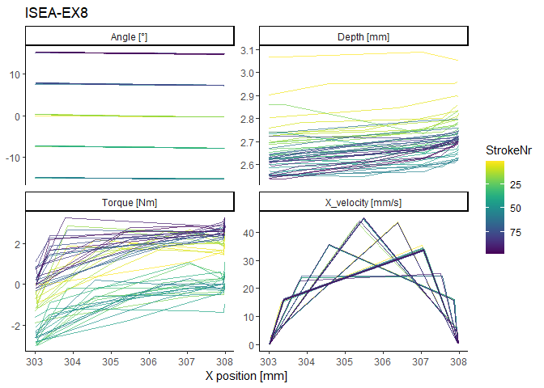<!-- -->


    $`ISEA-EX9`

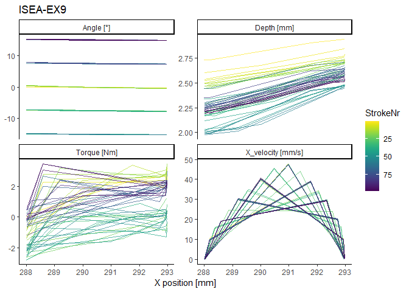<!-- -->


    $`ISEA-EX10`

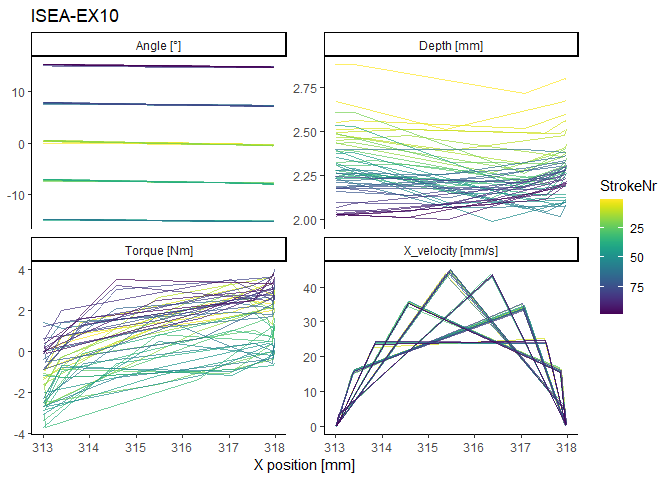<!-- -->


    $`ISEA-EX11`

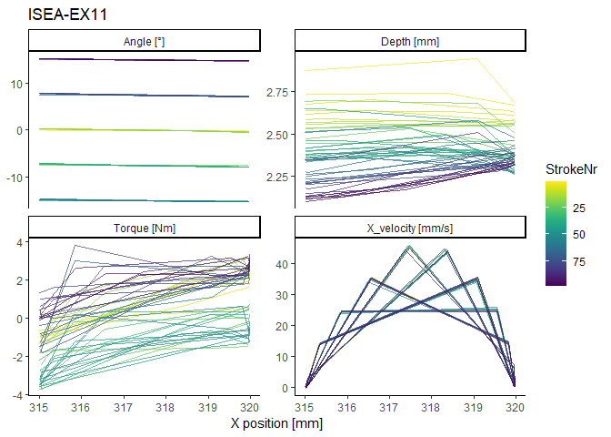<!-- -->


    $`ISEA-EX12`

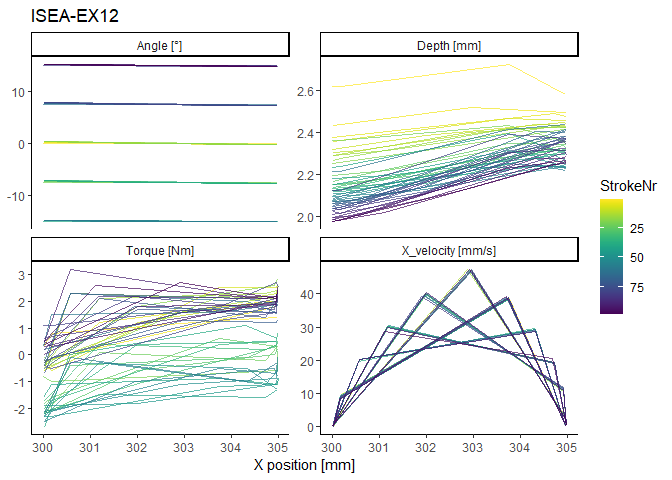<!-- -->

``` r
# Save list of plots
ggsave(filename = "ISEA_use-wear_Smarttester-plots_50strokes.pdf", 
       path = dir_plots, width = 190, units = "mm", 
       plot = marrangeGrob(p_1to50, nrow = 1, ncol = 1, top = NULL))
```

------------------------------------------------------------------------

# sessionInfo()

``` r
sessionInfo()
```

    R version 4.4.2 (2024-10-31 ucrt)
    Platform: x86_64-w64-mingw32/x64
    Running under: Windows 10 x64 (build 19045)

    Matrix products: default


    locale:
    [1] LC_COLLATE=English_United States.utf8 
    [2] LC_CTYPE=English_United States.utf8   
    [3] LC_MONETARY=English_United States.utf8
    [4] LC_NUMERIC=C                          
    [5] LC_TIME=English_United States.utf8    

    time zone: Europe/Berlin
    tzcode source: internal

    attached base packages:
    [1] stats     graphics  grDevices utils     datasets  methods   base     

    other attached packages:
     [1] viridis_0.6.5     viridisLite_0.4.2 lubridate_1.9.4   forcats_1.0.0    
     [5] stringr_1.5.1     dplyr_1.1.4       purrr_1.0.2       readr_2.1.5      
     [9] tidyr_1.3.1       tibble_3.2.1      tidyverse_2.0.0   rmarkdown_2.29   
    [13] R.utils_2.12.3    R.oo_1.27.0       R.methodsS3_1.8.2 knitr_1.49       
    [17] gridExtra_2.3     grateful_0.2.10   ggplot2_3.5.1    

    loaded via a namespace (and not attached):
     [1] sass_0.4.9        generics_0.1.3    stringi_1.8.4     hms_1.1.3        
     [5] digest_0.6.37     magrittr_2.0.3    evaluate_1.0.1    grid_4.4.2       
     [9] timechange_0.3.0  fastmap_1.2.0     rprojroot_2.0.4   jsonlite_1.8.9   
    [13] scales_1.3.0      textshaping_0.4.1 jquerylib_0.1.4   cli_3.6.3        
    [17] rlang_1.1.4       crayon_1.5.3      munsell_0.5.1     withr_3.0.2      
    [21] cachem_1.1.0      yaml_2.3.10       tools_4.4.2       tzdb_0.4.0       
    [25] colorspace_2.1-1  vctrs_0.6.5       R6_2.5.1          lifecycle_1.0.4  
    [29] ragg_1.3.3        pkgconfig_2.0.3   pillar_1.10.0     bslib_0.8.0      
    [33] gtable_0.3.6      glue_1.8.0        systemfonts_1.1.0 xfun_0.49        
    [37] tidyselect_1.2.1  rstudioapi_0.17.1 farver_2.1.2      htmltools_0.5.8.1
    [41] labeling_0.4.3    compiler_4.4.2   

------------------------------------------------------------------------

# Cite R packages used

| Package | Version | Citation |
|:---|:---|:---|
| base | 4.4.2 | R Core Team (2024) |
| grateful | 0.2.10 | Rodriguez-Sanchez and Jackson (2024) |
| gridExtra | 2.3 | Auguie (2017) |
| knitr | 1.49 | Xie (2014); Xie (2015); Xie (2024) |
| R.methodsS3 | 1.8.2 | Bengtsson (2003a) |
| R.oo | 1.27.0 | Bengtsson (2003b) |
| R.utils | 2.12.3 | Bengtsson (2023) |
| rmarkdown | 2.29 | Xie, Allaire, and Grolemund (2018); Xie, Dervieux, and Riederer (2020); Allaire et al. (2024) |
| tidyverse | 2.0.0 | Wickham et al. (2019) |
| viridis | 0.6.5 | Garnier et al. (2024) |
| viridisLite | 0.4.2 | Garnier et al. (2023) |
| RStudio | 2024.9.1.394 | Posit team (2024) |

## References

<div id="refs" class="references csl-bib-body hanging-indent"
entry-spacing="0">

<div id="ref-rmarkdown2024" class="csl-entry">

Allaire, JJ, Yihui Xie, Christophe Dervieux, Jonathan McPherson, Javier
Luraschi, Kevin Ushey, Aron Atkins, et al. 2024.
*<span class="nocase">rmarkdown</span>: Dynamic Documents for r*.
<https://github.com/rstudio/rmarkdown>.

</div>

<div id="ref-gridExtra" class="csl-entry">

Auguie, Baptiste. 2017. *<span class="nocase">gridExtra</span>:
Miscellaneous Functions for “Grid” Graphics*.
<https://CRAN.R-project.org/package=gridExtra>.

</div>

<div id="ref-RmethodsS3" class="csl-entry">

Bengtsson, Henrik. 2003a. “The <span class="nocase">R.oo</span>
Package - Object-Oriented Programming with References Using Standard R
Code.” In *Proceedings of the 3rd International Workshop on Distributed
Statistical Computing (DSC 2003)*, edited by Kurt Hornik, Friedrich
Leisch, and Achim Zeileis. Vienna, Austria:
https://www.r-project.org/conferences/DSC-2003/Proceedings/.
<https://www.r-project.org/conferences/DSC-2003/Proceedings/Bengtsson.pdf>.

</div>

<div id="ref-Roo" class="csl-entry">

———. 2003b. “The <span class="nocase">R.oo</span> Package -
Object-Oriented Programming with References Using Standard R Code.” In
*Proceedings of the 3rd International Workshop on Distributed
Statistical Computing (DSC 2003)*, edited by Kurt Hornik, Friedrich
Leisch, and Achim Zeileis. Vienna, Austria:
https://www.r-project.org/conferences/DSC-2003/Proceedings/.
<https://www.r-project.org/conferences/DSC-2003/Proceedings/Bengtsson.pdf>.

</div>

<div id="ref-Rutils" class="csl-entry">

———. 2023. *<span class="nocase">R.utils</span>: Various Programming
Utilities*. <https://CRAN.R-project.org/package=R.utils>.

</div>

<div id="ref-viridisLite" class="csl-entry">

Garnier, Simon, Ross, Noam, Rudis, Robert, Camargo, et al. 2023.
*<span class="nocase">viridis(Lite)</span> - Colorblind-Friendly Color
Maps for r*. <https://doi.org/10.5281/zenodo.4678327>.

</div>

<div id="ref-viridis" class="csl-entry">

———, et al. 2024. *<span class="nocase">viridis(Lite)</span> -
Colorblind-Friendly Color Maps for r*.
<https://doi.org/10.5281/zenodo.4679423>.

</div>

<div id="ref-rstudio" class="csl-entry">

Posit team. 2024. *RStudio: Integrated Development Environment for r*.
Boston, MA: Posit Software, PBC. <http://www.posit.co/>.

</div>

<div id="ref-base" class="csl-entry">

R Core Team. 2024. *R: A Language and Environment for Statistical
Computing*. Vienna, Austria: R Foundation for Statistical Computing.
<https://www.R-project.org/>.

</div>

<div id="ref-grateful" class="csl-entry">

Rodriguez-Sanchez, Francisco, and Connor P. Jackson. 2024.
*<span class="nocase">grateful</span>: Facilitate Citation of R
Packages*. <https://pakillo.github.io/grateful/>.

</div>

<div id="ref-tidyverse" class="csl-entry">

Wickham, Hadley, Mara Averick, Jennifer Bryan, Winston Chang, Lucy
D’Agostino McGowan, Romain François, Garrett Grolemund, et al. 2019.
“Welcome to the <span class="nocase">tidyverse</span>.” *Journal of Open
Source Software* 4 (43): 1686. <https://doi.org/10.21105/joss.01686>.

</div>

<div id="ref-knitr2014" class="csl-entry">

Xie, Yihui. 2014. “<span class="nocase">knitr</span>: A Comprehensive
Tool for Reproducible Research in R.” In *Implementing Reproducible
Computational Research*, edited by Victoria Stodden, Friedrich Leisch,
and Roger D. Peng. Chapman; Hall/CRC.

</div>

<div id="ref-knitr2015" class="csl-entry">

———. 2015. *Dynamic Documents with R and Knitr*. 2nd ed. Boca Raton,
Florida: Chapman; Hall/CRC. <https://yihui.org/knitr/>.

</div>

<div id="ref-knitr2024" class="csl-entry">

———. 2024. *<span class="nocase">knitr</span>: A General-Purpose Package
for Dynamic Report Generation in r*. <https://yihui.org/knitr/>.

</div>

<div id="ref-rmarkdown2018" class="csl-entry">

Xie, Yihui, J. J. Allaire, and Garrett Grolemund. 2018. *R Markdown: The
Definitive Guide*. Boca Raton, Florida: Chapman; Hall/CRC.
<https://bookdown.org/yihui/rmarkdown>.

</div>

<div id="ref-rmarkdown2020" class="csl-entry">

Xie, Yihui, Christophe Dervieux, and Emily Riederer. 2020. *R Markdown
Cookbook*. Boca Raton, Florida: Chapman; Hall/CRC.
<https://bookdown.org/yihui/rmarkdown-cookbook>.

</div>

</div>
