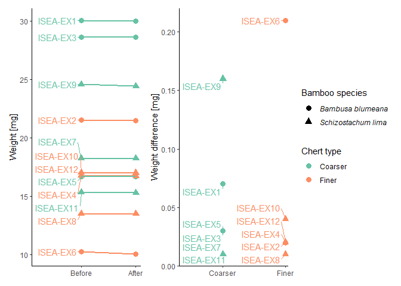

Plot tools’ weights dataset for the ISEA use-wear project
================
Ivan Calandra
2024-07-01 08:52:55 CEST

- [Goal of the script](#goal-of-the-script)
- [Load packages](#load-packages)
- [Read in and format data](#read-in-and-format-data)
  - [Read in CSV file](#read-in-csv-file)
  - [Change names of chert types](#change-names-of-chert-types)
- [Save data](#save-data)
  - [As XLSX](#as-xlsx)
  - [As Rbin](#as-rbin)
- [Plot](#plot)
  - [Pivot to long format for
    plotting](#pivot-to-long-format-for-plotting)
  - [Format column names for nice
    plotting](#format-column-names-for-nice-plotting)
  - [Absolute weights](#absolute-weights)
  - [Weight differences](#weight-differences)
  - [Combine and plot plots](#combine-and-plot-plots)
  - [Save plot](#save-plot)
- [Summary statistics](#summary-statistics)
  - [Create function to compute the statistics at
    once](#create-function-to-compute-the-statistics-at-once)
  - [Compute summary statistics](#compute-summary-statistics)
  - [Save as XLSX](#save-as-xlsx)
- [sessionInfo()](#sessioninfo)
- [Cite R packages used](#cite-r-packages-used)
  - [References](#references)

------------------------------------------------------------------------

# Goal of the script

This script imports and plots the tools’ weights before and after the
experiments.  
The script will:

1.  Read in the original CSV-file  
2.  Save data as Rbin and XLSX  
3.  Plot  
4.  Compute summary statistics

``` r
dir_in <- "analysis/raw_data/"
dir_data <- "analysis/derived_data/"
dir_plots <- "analysis/plots/"
dir_stats <- "analysis/stats/"
```

Input CSV file file must be located in “./analysis/raw_data/”.  
Plots will be saved in “./analysis/plots/”. Processed datasets will be
saved in “./analysis/derived_data/”. Summary statistics will be saved in
“./analysis/stats/”.

The knit directory for this script is the project directory.

------------------------------------------------------------------------

# Load packages

``` r
library(doBy)
library(ggplot2)
library(ggrepel)
library(grateful)
library(knitr)
library(patchwork)
library(R.utils)
library(rmarkdown)
library(tidyverse)
library(writexl)
```

------------------------------------------------------------------------

# Read in and format data

## Read in CSV file

``` r
file_in <- list.files(dir_in, pattern = "weight\\.csv$", full.names = TRUE)
weights <- read.csv(file_in, check.names = FALSE)
str(weights)
```

    'data.frame':   12 obs. of  6 variables:
     $ Sample            : chr  "ISEA-EX1" "ISEA-EX2" "ISEA-EX3" "ISEA-EX4" ...
     $ Chert_type        : chr  "A" "B" "A" "B" ...
     $ Chert_tool        : int  1 1 2 2 3 3 4 4 5 5 ...
     $ Bamboo_sp         : chr  "Bambusa blumeana" "Bambusa blumeana" "Bambusa blumeana" "Bambusa blumeana" ...
     $ Weight_before_[mg]: num  30.1 21.5 28.6 16.7 16.7 ...
     $ Weight_after_[mg] : num  30 21.5 28.6 16.7 16.7 ...

``` r
head(weights)
```

        Sample Chert_type Chert_tool        Bamboo_sp Weight_before_[mg]
    1 ISEA-EX1          A          1 Bambusa blumeana              30.07
    2 ISEA-EX2          B          1 Bambusa blumeana              21.52
    3 ISEA-EX3          A          2 Bambusa blumeana              28.65
    4 ISEA-EX4          B          2 Bambusa blumeana              16.69
    5 ISEA-EX5          A          3 Bambusa blumeana              16.69
    6 ISEA-EX6          B          3 Bambusa blumeana              10.25
      Weight_after_[mg]
    1             30.00
    2             21.50
    3             28.62
    4             16.67
    5             16.66
    6             10.04

## Change names of chert types

``` r
weights$Chert_type <- factor(weights$Chert_type, levels = c("A", "B"), labels = c("Coarser", "Finer")) %>% 
                      as.character()
str(weights)
```

    'data.frame':   12 obs. of  6 variables:
     $ Sample            : chr  "ISEA-EX1" "ISEA-EX2" "ISEA-EX3" "ISEA-EX4" ...
     $ Chert_type        : chr  "Coarser" "Finer" "Coarser" "Finer" ...
     $ Chert_tool        : int  1 1 2 2 3 3 4 4 5 5 ...
     $ Bamboo_sp         : chr  "Bambusa blumeana" "Bambusa blumeana" "Bambusa blumeana" "Bambusa blumeana" ...
     $ Weight_before_[mg]: num  30.1 21.5 28.6 16.7 16.7 ...
     $ Weight_after_[mg] : num  30 21.5 28.6 16.7 16.7 ...

``` r
head(weights)
```

        Sample Chert_type Chert_tool        Bamboo_sp Weight_before_[mg]
    1 ISEA-EX1    Coarser          1 Bambusa blumeana              30.07
    2 ISEA-EX2      Finer          1 Bambusa blumeana              21.52
    3 ISEA-EX3    Coarser          2 Bambusa blumeana              28.65
    4 ISEA-EX4      Finer          2 Bambusa blumeana              16.69
    5 ISEA-EX5    Coarser          3 Bambusa blumeana              16.69
    6 ISEA-EX6      Finer          3 Bambusa blumeana              10.25
      Weight_after_[mg]
    1             30.00
    2             21.50
    3             28.62
    4             16.67
    5             16.66
    6             10.04

------------------------------------------------------------------------

# Save data

## As XLSX

``` r
write_xlsx(weights, path = paste0(dir_data, "/ISEA_use-wear_Weights.xlsx"))
```

## As Rbin

``` r
saveObject(weights, file = paste0(dir_data, "/ISEA_use-wear_Weights.Rbin"))
```

Rbin files (e.g. `ISEA_use-wear_Weights.Rbin`) can be easily read into
an R object (e.g. `rbin_data`) using the following code:

``` r
library(R.utils)
rbin_data <- loadObject("ISEA_use-wear_Weights.Rbin")
```

------------------------------------------------------------------------

# Plot

## Pivot to long format for plotting

``` r
weights_long <-  weights %>% 
                 pivot_longer(contains("Weight"), names_to = "State_full", values_to = "Weight [mg]") %>% 
                 mutate(State = factor(gsub("Weight_|_\\[mg\\]", "", State_full), 
                                       levels = c("before", "after"), labels = c("Before", "After")))
```

## Format column names for nice plotting

``` r
# Color
color_name <- "Chert_type"
color_name_leg <- gsub("_", " ", color_name)

# Shapes
shape_name <- "Bamboo_sp"
shape_name_leg <- gsub("_", " ", shape_name) %>% 
                  gsub("sp", "species", .)
```

## Absolute weights

``` r
             # Define plot
p_weights <- ggplot(weights_long, aes(x = State, y = .data[["Weight [mg]"]], 
                                      color = .data[[color_name]], shape = .data[[shape_name]])) +
             
             # Add points
             geom_point(size = 3) +
  
             # Add lines to connect points with identical"Sample ID
             geom_line(linewidth = 1, aes(group = Sample), show.legend = FALSE) +
  
             # Add Sample ID to points at "before" state
             geom_text_repel(aes(label = ifelse(State == "Before", Sample, "")), show.legend = FALSE, 
                             hjust = 1, nudge_x = -0.1, direction = "y", 
                             min.segment.length = 0, segment.size = 0.3, seed = 123) +
   
             # Light theme
             theme_classic() +

             # Italicize species names in legend
             guides(shape = guide_legend(theme = theme(legend.text = element_text(face = "italic")))) +
  
             # Reduce margins around the plot
             scale_x_discrete(expand = expansion(add = c(0.9, 0.1))) +
  
             # The qualitative 'Set2' palette of RColorBrewer is colorblind friendly
             scale_color_brewer(palette = 'Set2') +
  
             # Remove xlab and use the clean name for the legend
             labs(x = NULL, color = color_name_leg, shape = shape_name_leg)
```

## Weight differences

In order to improve the readability of the weight changes, only the
differences are plotted.

The difference is the weight after minus the weight before. Since all
samples lost weight during the experiment, the absolute values are
plotted in order to only show the magnitude of the difference.

``` r
# Add column Weight_diff
weights <- mutate(weights, Weight_diff = abs(`Weight_after_[mg]` - `Weight_before_[mg]`))

          # Define plot
p_diff <- ggplot(weights, aes(x = .data[[color_name]], y = Weight_diff, 
                              color = .data[[color_name]], shape = .data[[shape_name]])) +
          
          # Add points
          geom_point(size = 3) +
  
          # Add Sample ID to points at "before" state
          geom_text_repel(aes(label = Sample), show.legend = FALSE, hjust = 1, nudge_x = -0.1, 
                          direction = "y", min.segment.length = 0, segment.size = 0.3, seed = 123) +
  
          # Light theme
          theme_classic() +
  
          # Italicize species names in legend
          guides(shape = guide_legend(theme = theme(legend.text = element_text(face = "italic")))) +
  
          # Reduce margins around the plot
          scale_x_discrete(expand = expansion(add = c(0.7, 0.05))) +
  
          # The qualitative 'Set2' palette of RColorBrewer is colorblind friendly
          scale_color_brewer(palette = 'Set2') +
  
          # Remove xlab and use the clean name for the legend
          labs(x = NULL, y = "Weight difference [mg]",color = color_name_leg, shape = shape_name_leg)
```

## Combine and plot plots

``` r
p_all <- p_weights + p_diff + plot_layout(guides = 'collect')
plot(p_all)
```

<!-- -->

## Save plot

``` r
ggsave(plot = p_all, paste0(dir_plots, "/ISEA_use-wear_Weights-plots.pdf"), width = 190, unit = "mm")
```

------------------------------------------------------------------------

# Summary statistics

## Create function to compute the statistics at once

``` r
nminmaxmeanmedsd <- function(x){
    y <- x[!is.na(x)]     # Exclude NAs
    n_test <- length(y)   # Sample size (n)
    min_test <- min(y)    # Minimum
    max_test <- max(y)    # Maximum
    mean_test <- mean(y)  # Mean
    med_test <- median(y) # Median
    sd_test <- sd(y)      # Standard deviation
    out <- c(n_test, min_test, max_test, mean_test, med_test, sd_test) # Concatenate
    names(out) <- c("n", "min", "max", "mean", "median", "sd")         # Name values
    return(out)                                                        # Object to return
}
```

## Compute summary statistics

``` r
# Remove unit from headers
names(weights) <- gsub("_\\[mg\\]", "", names(weights))

# Exclude Chert_tool column from data
weights_sel <- select(weights, !Chert_tool)

# Compute summary statistics based on Chert_type
stats_chert <- summaryBy(. ~ Chert_type, data = weights_sel, FUN = nminmaxmeanmedsd)
stats_chert[1:2]
```

      Chert_type Weight_before.n
    1    Coarser               6
    2      Finer               6

``` r
# Compute summary statistics based on Bamboo_sp
stats_bamboo <- summaryBy(. ~ Bamboo_sp, data = weights_sel, FUN = nminmaxmeanmedsd)
stats_bamboo[1:2]
```

               Bamboo_sp Weight_before.n
    1   Bambusa blumeana               6
    2 Schizostachum lima               6

``` r
# Compute summary statistics based on Chert_type and Bamboo_sp
stats_chert_bamboo <- summaryBy(. ~ Chert_type + Bamboo_sp, data = weights_sel, FUN = nminmaxmeanmedsd)
stats_chert_bamboo[1:3]
```

      Chert_type          Bamboo_sp Weight_before.n
    1    Coarser   Bambusa blumeana               3
    2    Coarser Schizostachum lima               3
    3      Finer   Bambusa blumeana               3
    4      Finer Schizostachum lima               3

## Save as XLSX

``` r
write_xlsx(list("Chert type" = stats_chert, "Bamboo species" = stats_bamboo,
                "Chert+Bamboo" = stats_chert_bamboo), 
           path = paste0(dir_stats, "/ISEA_use-wear_Weights-stats.xlsx"))
```

------------------------------------------------------------------------

# sessionInfo()

``` r
sessionInfo()
```

    R version 4.4.0 (2024-04-24 ucrt)
    Platform: x86_64-w64-mingw32/x64
    Running under: Windows 10 x64 (build 19045)

    Matrix products: default


    locale:
    [1] LC_COLLATE=English_United States.utf8 
    [2] LC_CTYPE=English_United States.utf8   
    [3] LC_MONETARY=English_United States.utf8
    [4] LC_NUMERIC=C                          
    [5] LC_TIME=English_United States.utf8    

    time zone: Europe/Berlin
    tzcode source: internal

    attached base packages:
    [1] stats     graphics  grDevices utils     datasets  methods   base     

    other attached packages:
     [1] writexl_1.5.0     lubridate_1.9.3   forcats_1.0.0     stringr_1.5.1    
     [5] dplyr_1.1.4       purrr_1.0.2       readr_2.1.5       tidyr_1.3.1      
     [9] tibble_3.2.1      tidyverse_2.0.0   rmarkdown_2.27    R.utils_2.12.3   
    [13] R.oo_1.26.0       R.methodsS3_1.8.2 patchwork_1.2.0   knitr_1.47       
    [17] grateful_0.2.7    ggrepel_0.9.5     ggplot2_3.5.1     doBy_4.6.21      

    loaded via a namespace (and not attached):
     [1] gtable_0.3.5          xfun_0.44             bslib_0.7.0          
     [4] lattice_0.22-6        tzdb_0.4.0            vctrs_0.6.5          
     [7] tools_4.4.0           generics_0.1.3        fansi_1.0.6          
    [10] highr_0.11            pkgconfig_2.0.3       Matrix_1.7-0         
    [13] RColorBrewer_1.1-3    lifecycle_1.0.4       farver_2.1.2         
    [16] compiler_4.4.0        textshaping_0.4.0     microbenchmark_1.4.10
    [19] munsell_0.5.1         htmltools_0.5.8.1     sass_0.4.9           
    [22] yaml_2.3.8            pillar_1.9.0          jquerylib_0.1.4      
    [25] MASS_7.3-60.2         cachem_1.1.0          boot_1.3-30          
    [28] Deriv_4.1.3           tidyselect_1.2.1      digest_0.6.35        
    [31] stringi_1.8.4         labeling_0.4.3        cowplot_1.1.3        
    [34] rprojroot_2.0.4       fastmap_1.2.0         grid_4.4.0           
    [37] colorspace_2.1-0      cli_3.6.2             magrittr_2.0.3       
    [40] utf8_1.2.4            broom_1.0.6           withr_3.0.0          
    [43] scales_1.3.0          backports_1.5.0       timechange_0.3.0     
    [46] modelr_0.1.11         ragg_1.3.2            hms_1.1.3            
    [49] evaluate_0.23         rlang_1.1.4           Rcpp_1.0.12          
    [52] glue_1.7.0            rstudioapi_0.16.0     jsonlite_1.8.8       
    [55] R6_2.5.1              systemfonts_1.1.0    

------------------------------------------------------------------------

# Cite R packages used

| Package     | Version      | Citation                                                                                      |
|:------------|:-------------|:----------------------------------------------------------------------------------------------|
| base        | 4.4.0        | R Core Team (2024)                                                                            |
| doBy        | 4.6.21       | Højsgaard and Halekoh (2024)                                                                  |
| ggrepel     | 0.9.5        | Slowikowski (2024)                                                                            |
| grateful    | 0.2.7        | Rodriguez-Sanchez and Jackson (2023)                                                          |
| knitr       | 1.47         | Xie (2014); Xie (2015); Xie (2024)                                                            |
| patchwork   | 1.2.0        | Pedersen (2024)                                                                               |
| R.methodsS3 | 1.8.2        | Bengtsson (2003a)                                                                             |
| R.oo        | 1.26.0       | Bengtsson (2003b)                                                                             |
| R.utils     | 2.12.3       | Bengtsson (2023)                                                                              |
| rmarkdown   | 2.27         | Xie, Allaire, and Grolemund (2018); Xie, Dervieux, and Riederer (2020); Allaire et al. (2024) |
| tidyverse   | 2.0.0        | Wickham et al. (2019)                                                                         |
| writexl     | 1.5.0        | Ooms (2024)                                                                                   |
| RStudio     | 2024.4.1.748 | Posit team (2024)                                                                             |

## References

<div id="refs" class="references csl-bib-body hanging-indent"
entry-spacing="0">

<div id="ref-rmarkdown2024" class="csl-entry">

Allaire, JJ, Yihui Xie, Christophe Dervieux, Jonathan McPherson, Javier
Luraschi, Kevin Ushey, Aron Atkins, et al. 2024.
*<span class="nocase">rmarkdown</span>: Dynamic Documents for r*.
<https://github.com/rstudio/rmarkdown>.

</div>

<div id="ref-RmethodsS3" class="csl-entry">

Bengtsson, Henrik. 2003a. “The <span class="nocase">R.oo</span>
Package - Object-Oriented Programming with References Using Standard R
Code.” In *Proceedings of the 3rd International Workshop on Distributed
Statistical Computing (DSC 2003)*, edited by Kurt Hornik, Friedrich
Leisch, and Achim Zeileis. Vienna, Austria:
https://www.r-project.org/conferences/DSC-2003/Proceedings/.
<https://www.r-project.org/conferences/DSC-2003/Proceedings/Bengtsson.pdf>.

</div>

<div id="ref-Roo" class="csl-entry">

———. 2003b. “The <span class="nocase">R.oo</span> Package -
Object-Oriented Programming with References Using Standard R Code.” In
*Proceedings of the 3rd International Workshop on Distributed
Statistical Computing (DSC 2003)*, edited by Kurt Hornik, Friedrich
Leisch, and Achim Zeileis. Vienna, Austria:
https://www.r-project.org/conferences/DSC-2003/Proceedings/.
<https://www.r-project.org/conferences/DSC-2003/Proceedings/Bengtsson.pdf>.

</div>

<div id="ref-Rutils" class="csl-entry">

———. 2023. *<span class="nocase">R.utils</span>: Various Programming
Utilities*. <https://CRAN.R-project.org/package=R.utils>.

</div>

<div id="ref-doBy" class="csl-entry">

Højsgaard, Søren, and Ulrich Halekoh. 2024.
*<span class="nocase">doBy</span>: Groupwise Statistics, LSmeans, Linear
Estimates, Utilities*. <https://CRAN.R-project.org/package=doBy>.

</div>

<div id="ref-writexl" class="csl-entry">

Ooms, Jeroen. 2024. *<span class="nocase">writexl</span>: Export Data
Frames to Excel “<span class="nocase">xlsx</span>” Format*.
<https://CRAN.R-project.org/package=writexl>.

</div>

<div id="ref-patchwork" class="csl-entry">

Pedersen, Thomas Lin. 2024. *<span class="nocase">patchwork</span>: The
Composer of Plots*. <https://CRAN.R-project.org/package=patchwork>.

</div>

<div id="ref-rstudio" class="csl-entry">

Posit team. 2024. *RStudio: Integrated Development Environment for r*.
Boston, MA: Posit Software, PBC. <http://www.posit.co/>.

</div>

<div id="ref-base" class="csl-entry">

R Core Team. 2024. *R: A Language and Environment for Statistical
Computing*. Vienna, Austria: R Foundation for Statistical Computing.
<https://www.R-project.org/>.

</div>

<div id="ref-grateful" class="csl-entry">

Rodriguez-Sanchez, Francisco, and Connor P. Jackson. 2023.
*<span class="nocase">grateful</span>: Facilitate Citation of r
Packages*. <https://pakillo.github.io/grateful/>.

</div>

<div id="ref-ggrepel" class="csl-entry">

Slowikowski, Kamil. 2024. *<span class="nocase">ggrepel</span>:
Automatically Position Non-Overlapping Text Labels with
“<span class="nocase">ggplot2</span>”*.
<https://CRAN.R-project.org/package=ggrepel>.

</div>

<div id="ref-tidyverse" class="csl-entry">

Wickham, Hadley, Mara Averick, Jennifer Bryan, Winston Chang, Lucy
D’Agostino McGowan, Romain François, Garrett Grolemund, et al. 2019.
“Welcome to the <span class="nocase">tidyverse</span>.” *Journal of Open
Source Software* 4 (43): 1686. <https://doi.org/10.21105/joss.01686>.

</div>

<div id="ref-knitr2014" class="csl-entry">

Xie, Yihui. 2014. “<span class="nocase">knitr</span>: A Comprehensive
Tool for Reproducible Research in R.” In *Implementing Reproducible
Computational Research*, edited by Victoria Stodden, Friedrich Leisch,
and Roger D. Peng. Chapman; Hall/CRC.

</div>

<div id="ref-knitr2015" class="csl-entry">

———. 2015. *Dynamic Documents with R and Knitr*. 2nd ed. Boca Raton,
Florida: Chapman; Hall/CRC. <https://yihui.org/knitr/>.

</div>

<div id="ref-knitr2024" class="csl-entry">

———. 2024. *<span class="nocase">knitr</span>: A General-Purpose Package
for Dynamic Report Generation in r*. <https://yihui.org/knitr/>.

</div>

<div id="ref-rmarkdown2018" class="csl-entry">

Xie, Yihui, J. J. Allaire, and Garrett Grolemund. 2018. *R Markdown: The
Definitive Guide*. Boca Raton, Florida: Chapman; Hall/CRC.
<https://bookdown.org/yihui/rmarkdown>.

</div>

<div id="ref-rmarkdown2020" class="csl-entry">

Xie, Yihui, Christophe Dervieux, and Emily Riederer. 2020. *R Markdown
Cookbook*. Boca Raton, Florida: Chapman; Hall/CRC.
<https://bookdown.org/yihui/rmarkdown-cookbook>.

</div>

</div>
