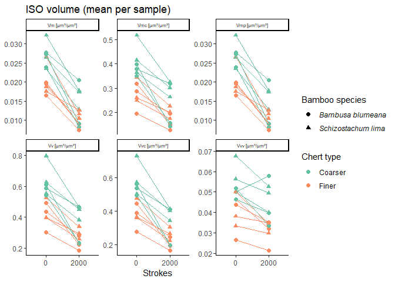
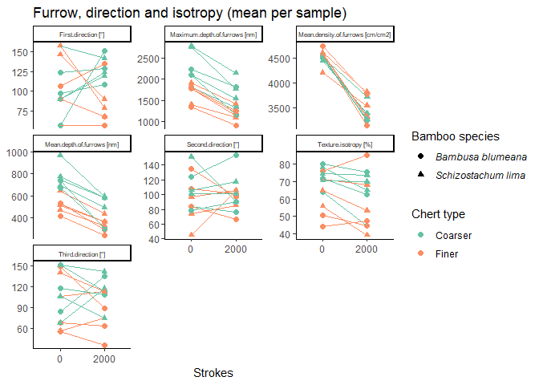
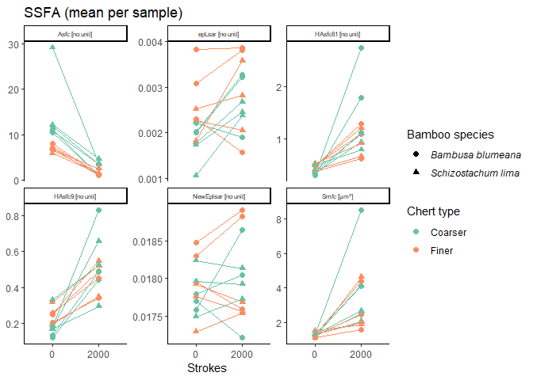

Plots for the ISEA use-wear dataset
================
Ivan Calandra
2024-06-26 14:46:44 CEST

- [Goal of the script](#goal-of-the-script)
- [Load packages](#load-packages)
- [Read in and format data](#read-in-and-format-data)
  - [Read in Rbin file](#read-in-rbin-file)
  - [Calculate the mean per sample](#calculate-the-mean-per-sample)
  - [Add units to headers for
    plotting](#add-units-to-headers-for-plotting)
  - [Define parameter types for grouping
    plots](#define-parameter-types-for-grouping-plots)
- [Plot each surface parameter in a
  boxplot](#plot-each-surface-parameter-in-a-boxplot)
  - [Define variables](#define-variables)
  - [Create lists to receive the
    plots](#create-lists-to-receive-the-plots)
  - [Plots](#plots)
- [PCA](#pca)
- [sessionInfo()](#sessioninfo)
- [Cite R packages used](#cite-r-packages-used)
  - [References](#references)

------------------------------------------------------------------------

# Goal of the script

The script plots all STA variables for the ISEA use-wear dataset.

``` r
dir_in  <- "analysis/derived_data"
dir_plots <- "analysis/plots"
```

Input Rbin data file must be located in “./analysis/derived_data”.  
Plots will be saved in “./analysis/plots”.

The knit directory for this script is the project directory.

------------------------------------------------------------------------

# Load packages

``` r
library(doBy)
library(factoextra)
library(ggplot2)
library(grateful)
library(gridExtra)
library(knitr)
library(R.utils)
library(RColorBrewer)
library(rmarkdown)
library(tidyverse)
```

------------------------------------------------------------------------

# Read in and format data

## Read in Rbin file

``` r
STA <- list.files(dir_in, pattern = "STA\\.Rbin$", full.names = TRUE) %>% 
       loadObject()
str(STA)
```

    'data.frame':   96 obs. of  44 variables:
     $ Sample                  : chr  "ISEA-EX1" "ISEA-EX1" "ISEA-EX1" "ISEA-EX1" ...
     $ Chert_type              : chr  "A" "A" "A" "A" ...
     $ Chert_tool              : num  1 1 1 1 1 1 1 1 2 2 ...
     $ Bamboo_sp               : chr  "Bambusa blumeana" "Bambusa blumeana" "Bambusa blumeana" "Bambusa blumeana" ...
     $ Objective               : chr  "20x-0.70" "20x-0.70" "20x-0.70" "20x-0.70" ...
     $ Side                    : chr  "dorsal" "dorsal" "dorsal" "dorsal" ...
     $ Location                : num  1 1 2 2 1 1 2 2 1 1 ...
     $ Strokes                 : Factor w/ 2 levels "0","2000": 1 2 1 2 1 2 1 2 1 2 ...
     $ NMP                     : num  0.2 0.2 0.2 0.2 0.2 ...
     $ Sq                      : num  357 191 472 342 494 ...
     $ Ssk                     : num  0.214 -1.113 0.178 -0.483 0.16 ...
     $ Sku                     : num  3.57 5.75 3.62 3.99 3.54 ...
     $ Sp                      : num  1420 462 1680 972 1866 ...
     $ Sv                      : num  1545 915 1554 1339 1782 ...
     $ Sz                      : num  2965 1377 3234 2311 3648 ...
     $ Sa                      : num  281 138 363 257 384 ...
     $ Smr                     : num  11.76 97.77 8.12 57.82 4.77 ...
     $ Smc                     : num  458 204 611 398 600 ...
     $ Sxp                     : num  635 538 878 825 922 ...
     $ Sal                     : num  4.87 5.21 4.88 5.27 4.55 ...
     $ Str                     : num  0.758 0.569 0.703 0.685 0.381 ...
     $ Std                     : num  12.99 3.49 122.24 176 70.5 ...
     $ Ssw                     : num  0.425 0.425 0.425 0.425 0.425 ...
     $ Sdq                     : num  0.3 0.108 0.368 0.196 0.348 ...
     $ Sdr                     : num  4.214 0.567 6.193 1.829 5.46 ...
     $ Vm                      : num  0.02066 0.00826 0.02791 0.01744 0.03185 ...
     $ Vv                      : num  0.478 0.212 0.639 0.415 0.632 ...
     $ Vmp                     : num  0.02066 0.00826 0.02791 0.01744 0.03185 ...
     $ Vmc                     : num  0.309 0.141 0.388 0.273 0.427 ...
     $ Vvc                     : num  0.442 0.178 0.585 0.362 0.577 ...
     $ Vvv                     : num  0.0363 0.0336 0.0534 0.0529 0.0549 ...
     $ Maximum.depth.of.furrows: num  1943 1100 2275 1627 2427 ...
     $ Mean.depth.of.furrows   : num  618 288 849 578 761 ...
     $ Mean.density.of.furrows : num  4525 3019 4495 3192 4469 ...
     $ First.direction         : num  8.56e-03 1.80e+02 1.35e+02 9.00e+01 7.15e+01 ...
     $ Second.direction        : num  135.0227 44.9859 0.0106 135.0149 63.4786 ...
     $ Third.direction         : num  154 135 90 180 45 ...
     $ Texture.isotropy        : num  71.2 52.6 70.9 68.9 43.3 ...
     $ Asfc                    : num  9.485 0.868 13.86 2.864 11.287 ...
     $ Smfc                    : num  1.12 1.99 1.12 3.77 1.28 ...
     $ HAsfc9                  : num  0.115 0.364 0.081 0.456 0.151 ...
     $ HAsfc81                 : num  0.315 1.338 0.265 0.935 0.335 ...
     $ epLsar                  : num  0.001508 0.00233 0.000946 0.001366 0.003606 ...
     $ NewEplsar               : num  0.0183 0.0187 0.0179 0.0181 0.0174 ...
     - attr(*, "comment")= Named chr [1:36] "%" "nm" "<no unit>" "<no unit>" ...
      ..- attr(*, "names")= chr [1:36] "NMP" "Sq" "Ssk" "Sku" ...

``` r
head(STA)
```

        Sample Chert_type Chert_tool        Bamboo_sp Objective    Side Location
    1 ISEA-EX1          A          1 Bambusa blumeana  20x-0.70  dorsal        1
    2 ISEA-EX1          A          1 Bambusa blumeana  20x-0.70  dorsal        1
    3 ISEA-EX1          A          1 Bambusa blumeana  20x-0.70  dorsal        2
    4 ISEA-EX1          A          1 Bambusa blumeana  20x-0.70  dorsal        2
    5 ISEA-EX1          A          1 Bambusa blumeana  20x-0.70 ventral        1
    6 ISEA-EX1          A          1 Bambusa blumeana  20x-0.70 ventral        1
      Strokes       NMP       Sq        Ssk      Sku        Sp        Sv       Sz
    1       0 0.1999580 357.3100  0.2142039 3.572470 1419.5761 1545.3036 2964.880
    2    2000 0.1999580 191.0983 -1.1130610 5.748940  461.6364  914.8954 1376.532
    3       0 0.1999580 471.9081  0.1782349 3.617312 1680.0238 1554.4562 3234.480
    4    2000 0.1997480 341.9963 -0.4827666 3.993075  971.5410 1339.2310 2310.772
    5       0 0.1997480 494.3200  0.1601631 3.540429 1865.5175 1782.4093 3647.927
    6    2000 0.1995379 750.0697 -0.1556915 3.433134 2298.9824 2423.0967 4722.079
            Sa       Smr      Smc       Sxp      Sal       Str        Std       Ssw
    1 280.9127 11.763569 457.6620  635.0391 4.873127 0.7581494  12.989301 0.4248838
    2 137.9229 97.772232 203.5721  538.2645 5.211629 0.5687682   3.488485 0.4248838
    3 363.2579  8.120664 610.6844  877.8419 4.882320 0.7032365 122.238224 0.4248838
    4 257.0249 57.824111 397.9082  825.3227 5.274232 0.6848816 175.998406 0.4248838
    5 383.6674  4.769773 599.8546  921.5167 4.548254 0.3812570  70.500470 0.4248838
    6 581.3924  4.111890 867.8968 1656.4436 5.219970        NA  73.747646 0.4248838
            Sdq      Sdr          Vm        Vv         Vmp       Vmc       Vvc
    1 0.2997760 4.213511 0.020655078 0.4783037 0.020655078 0.3087765 0.4420467
    2 0.1077379 0.567455 0.008262461 0.2118332 0.008262461 0.1410964 0.1781942
    3 0.3679264 6.192882 0.027908316 0.6385740 0.027908316 0.3880665 0.5852113
    4 0.1962781 1.828874 0.017438165 0.4153293 0.017438165 0.2731001 0.3623892
    5 0.3484251 5.459936 0.031852956 0.6316956 0.031852956 0.4271848 0.5768188
    6 0.3764940 5.751873 0.043690817 0.9116036 0.043690817 0.6312824 0.8100546
             Vvv Maximum.depth.of.furrows Mean.depth.of.furrows
    1 0.03625709                 1942.646              618.3156
    2 0.03363900                 1100.149              288.0931
    3 0.05336270                 2275.050              849.3013
    4 0.05294018                 1627.004              577.8517
    5 0.05487685                 2427.417              760.6523
    6 0.10154900                 3050.083             1078.4730
      Mean.density.of.furrows First.direction Second.direction Third.direction
    1                4525.126    8.557293e-03     135.02266890       153.55462
    2                3018.786    1.799960e+02      44.98590072       134.99670
    3                4494.570    1.350326e+02       0.01062171        89.98775
    4                3191.931    8.999939e+01     135.01492680       179.98965
    5                4469.495    7.146393e+01      63.47858619        44.98322
    6                3565.619    7.152644e+01      63.52035976        89.99952
      Texture.isotropy       Asfc     Smfc     HAsfc9   HAsfc81       epLsar
    1        71.199627  9.4851127 1.124339 0.11542648 0.3151333 0.0015082547
    2        52.594359  0.8677973 1.993686 0.36432069 1.3382342 0.0023296235
    3        70.932914 13.8604793 1.124339 0.08100962 0.2650551 0.0009464416
    4        68.889231  2.8641345 3.767525 0.45631532 0.9349030 0.0013657628
    5        43.275061 11.2865846 1.276960 0.15097810 0.3349801 0.0036062641
    6         9.334622  8.1544882 1.993686 0.41098424 0.8871420 0.0058686109
       NewEplsar
    1 0.01833031
    2 0.01866927
    3 0.01791761
    4 0.01812746
    5 0.01742323
    6 0.01564744

## Calculate the mean per sample

There are 12 samples, with height maps acquired on 2 sides (dorsal and
ventral), 2 locations per side, and at 0 and 2000 strokes. This equals
to 96 data points.

In order to avoid cluttering the plots, the mean per sample (n = 12 at 0
and 2000 strokes) is plotted rather than every single data point.

``` r
# Exclude Chert_tool, Location and NMP columns from data because they are numeric yet not relevant for plots
STA_sel <- select(STA, !c(Chert_tool, Location, NMP))

# Calculate mean based on Sample + Strokes
# Bamboo_sp and Chert_type are listed as factors in order to keep these columns
# keep.names = TRUE is important for the matching on names in the next steps
STA_mean <- summaryBy(.~ Sample + Bamboo_sp + Chert_type + Strokes, data = STA_sel, FUN = mean, keep.names = TRUE)
```

## Add units to headers for plotting

``` r
# Get units from comment(STA)
table_units <- comment(STA) %>% 
               data.frame(Parameter = names(.), Unit = ., row.names = NULL) %>% 
  
               # Exclude NMP because it won't be plotted
               filter(Parameter != "NMP") %>% 
  
               # Paste parameter name and unit together in a new column
               mutate(Param_unit = paste0(Parameter, " [", Unit, "]")) 

# Remove > and < symbols
table_units$Param_unit <- gsub(">|<", "", table_units$Param_unit)

# Adjust column names
colnames(STA_mean)[colnames(STA_mean) %in% table_units$Parameter] <- table_units$Param_unit
```

## Define parameter types for grouping plots

``` r
table_units[table_units$Parameter %in% c("Sq", "Ssk", "Sku", "Sp", "Sv", "Sz", "Sa"), 
            "Type"] <- "ISO height"

table_units[grepl("^V[a-z]{1,2}", table_units$Parameter), "Type"] <- "ISO volume"

table_units[table_units$Parameter %in% c("Smr", "Smc", "Sxp", "Sal", "Str", "Std", "Ssw", "Sdq", "Sdr"), 
            "Type"] <- "ISO other"

table_units[grepl("furrows|direction|isotropy", table_units$Parameter), 
            "Type"] <- "Furrow, direction and isotropy"

table_units[grepl("Asfc|(?i)eplsar|Smfc", table_units$Parameter), "Type"] <- "SSFA"

table_units[c("Param_unit", "Type")]
```

                             Param_unit                           Type
    1                           Sq [nm]                     ISO height
    2                     Ssk [no unit]                     ISO height
    3                     Sku [no unit]                     ISO height
    4                           Sp [nm]                     ISO height
    5                           Sv [nm]                     ISO height
    6                           Sz [nm]                     ISO height
    7                           Sa [nm]                     ISO height
    8                           Smr [%]                      ISO other
    9                          Smc [nm]                      ISO other
    10                         Sxp [nm]                      ISO other
    11                         Sal [µm]                      ISO other
    12                    Str [no unit]                      ISO other
    13                          Std [°]                      ISO other
    14                         Ssw [µm]                      ISO other
    15                    Sdq [no unit]                      ISO other
    16                          Sdr [%]                      ISO other
    17                     Vm [µm³/µm²]                     ISO volume
    18                     Vv [µm³/µm²]                     ISO volume
    19                    Vmp [µm³/µm²]                     ISO volume
    20                    Vmc [µm³/µm²]                     ISO volume
    21                    Vvc [µm³/µm²]                     ISO volume
    22                    Vvv [µm³/µm²]                     ISO volume
    23    Maximum.depth.of.furrows [nm] Furrow, direction and isotropy
    24       Mean.depth.of.furrows [nm] Furrow, direction and isotropy
    25 Mean.density.of.furrows [cm/cm2] Furrow, direction and isotropy
    26              First.direction [°] Furrow, direction and isotropy
    27             Second.direction [°] Furrow, direction and isotropy
    28              Third.direction [°] Furrow, direction and isotropy
    29             Texture.isotropy [%] Furrow, direction and isotropy
    30                   Asfc [no unit]                           SSFA
    31                       Smfc [µm²]                           SSFA
    32                 HAsfc9 [no unit]                           SSFA
    33                HAsfc81 [no unit]                           SSFA
    34                 epLsar [no unit]                           SSFA
    35              NewEplsar [no unit]                           SSFA

------------------------------------------------------------------------

# Plot each surface parameter in a boxplot

## Define variables

Here we define which columns are used for the plots.

``` r
# Columns to be used to group on the x-axis
x_var <- "Strokes"

# colors
grp_colors <- "Chert_type"
color_name_leg <- gsub("_", " ", grp_colors)

# shapes
grp_shapes <- "Bamboo_sp"
shape_name_leg <- gsub("_", " ", grp_shapes)
```

## Create lists to receive the plots

``` r
p_box <- vector(mode = "list", length = length(unique(table_units$Type)))
names(p_box) <- unique(table_units$Type)
```

## Plots

``` r
# Plot for every set of parameters
for (i in names(p_box)) {
  
  # Subset parameter names by type
  y_var_i <- table_units[table_units$Type == i, "Param_unit"]
  
  # Select columns that will be used in the plotting
  data_i <- select(STA_mean, all_of(c("Sample", "Bamboo_sp", x_var, y_var_i, grp_colors, grp_shapes))) %>%
  
            # Pivot to longer format for facet plots
            pivot_longer(all_of(y_var_i), names_to = "Parameter", values_to = "Value")
  
  # Plot        # Define aesthetics
  p_box[[i]] <- ggplot(data_i, aes(x = .data[[x_var]], y = Value,
                                   color = .data[[grp_colors]], shape = .data[[grp_shapes]])) +

                # Add points
                geom_point(size = 2) +
    
                # Add lines to connect points with identical"Sample ID
                geom_line(linewidth = 0.5, aes(group = Sample), 
                          show.legend = FALSE) +
    
                # Facet plot by 'Parameter' (= 'y_var_i')
                facet_wrap(~ Parameter, scales = "free_y") +
    
                # Light theme
                theme_classic() +
    
                # Italicize species names in legend
                guides(shape = guide_legend(theme = theme(legend.text = element_text(face = "italic")))) +
    
                # Reduce font size of the facet labels so that they fit in the box
                theme(strip.text = element_text(size = 6)) +
  
                # The qualitative 'Set2' palette of RColorBrewer is colorblind friendly
                scale_color_brewer(palette = 'Set2') +
  
                # Remove xlab and use the clean name for the legend
                labs(y = NULL, title = paste0(i, " (mean per sample)"), 
                     color = color_name_leg, shape = shape_name_leg)
}

# Print plot
print(p_box)
```

    $`ISO height`

<!-- -->


    $`ISO other`

    Warning: Removed 2 rows containing missing values or values outside the scale range
    (`geom_point()`).

<!-- -->


    $`ISO volume`

<!-- -->


    $`Furrow, direction and isotropy`

<!-- -->


    $SSFA

<!-- -->

``` r
# Save list of plots
ggsave(filename = "ISEA_use-wear_STA-plots.pdf", 
       path = dir_plots, width = 190, units = "mm", 
       plot = marrangeGrob(p_box, nrow = 1, ncol = 1, top = NULL))
```

    Warning: Removed 2 rows containing missing values or values outside the scale range
    (`geom_point()`).

------------------------------------------------------------------------

# PCA

TO DO

------------------------------------------------------------------------

# sessionInfo()

``` r
sessionInfo()
```

    R version 4.4.1 (2024-06-14 ucrt)
    Platform: x86_64-w64-mingw32/x64
    Running under: Windows 10 x64 (build 19045)

    Matrix products: default


    locale:
    [1] LC_COLLATE=French_France.utf8  LC_CTYPE=French_France.utf8   
    [3] LC_MONETARY=French_France.utf8 LC_NUMERIC=C                  
    [5] LC_TIME=French_France.utf8    

    time zone: Europe/Berlin
    tzcode source: internal

    attached base packages:
    [1] stats     graphics  grDevices utils     datasets  methods   base     

    other attached packages:
     [1] lubridate_1.9.3    forcats_1.0.0      stringr_1.5.1      dplyr_1.1.4       
     [5] purrr_1.0.2        readr_2.1.5        tidyr_1.3.1        tibble_3.2.1      
     [9] tidyverse_2.0.0    rmarkdown_2.27     RColorBrewer_1.1-3 R.utils_2.12.3    
    [13] R.oo_1.26.0        R.methodsS3_1.8.2  knitr_1.47         gridExtra_2.3     
    [17] grateful_0.2.9     factoextra_1.0.7   ggplot2_3.5.1      doBy_4.6.22       

    loaded via a namespace (and not attached):
     [1] gtable_0.3.5          xfun_0.45             bslib_0.7.0          
     [4] ggrepel_0.9.5         lattice_0.22-6        tzdb_0.4.0           
     [7] vctrs_0.6.5           tools_4.4.1           generics_0.1.3       
    [10] fansi_1.0.6           highr_0.11            pkgconfig_2.0.3      
    [13] Matrix_1.7-0          lifecycle_1.0.4       compiler_4.4.1       
    [16] farver_2.1.2          textshaping_0.4.0     microbenchmark_1.4.10
    [19] munsell_0.5.1         htmltools_0.5.8.1     sass_0.4.9           
    [22] yaml_2.3.8            pillar_1.9.0          jquerylib_0.1.4      
    [25] MASS_7.3-60.2         cachem_1.1.0          boot_1.3-30          
    [28] Deriv_4.1.3           tidyselect_1.2.1      digest_0.6.36        
    [31] stringi_1.8.4         labeling_0.4.3        cowplot_1.1.3        
    [34] rprojroot_2.0.4       fastmap_1.2.0         grid_4.4.1           
    [37] colorspace_2.1-0      cli_3.6.3             magrittr_2.0.3       
    [40] utf8_1.2.4            broom_1.0.6           withr_3.0.0          
    [43] scales_1.3.0          backports_1.5.0       timechange_0.3.0     
    [46] modelr_0.1.11         ragg_1.3.2            hms_1.1.3            
    [49] evaluate_0.24.0       rlang_1.1.4           Rcpp_1.0.12          
    [52] glue_1.7.0            rstudioapi_0.16.0     jsonlite_1.8.8       
    [55] R6_2.5.1              systemfonts_1.1.0    

------------------------------------------------------------------------

# Cite R packages used

| Package      | Version      | Citation                                                                                      |
|:-------------|:-------------|:----------------------------------------------------------------------------------------------|
| base         | 4.4.1        | R Core Team (2024)                                                                            |
| doBy         | 4.6.22       | Højsgaard and Halekoh (2024)                                                                  |
| factoextra   | 1.0.7        | Kassambara and Mundt (2020)                                                                   |
| grateful     | 0.2.9        | Rodriguez-Sanchez and Jackson (2023)                                                          |
| gridExtra    | 2.3          | Auguie (2017)                                                                                 |
| knitr        | 1.47         | Xie (2014); Xie (2015); Xie (2024)                                                            |
| R.methodsS3  | 1.8.2        | Bengtsson (2003a)                                                                             |
| R.oo         | 1.26.0       | Bengtsson (2003b)                                                                             |
| R.utils      | 2.12.3       | Bengtsson (2023)                                                                              |
| RColorBrewer | 1.1.3        | Neuwirth (2022)                                                                               |
| rmarkdown    | 2.27         | Xie, Allaire, and Grolemund (2018); Xie, Dervieux, and Riederer (2020); Allaire et al. (2024) |
| tidyverse    | 2.0.0        | Wickham et al. (2019)                                                                         |
| RStudio      | 2024.4.2.764 | Posit team (2024)                                                                             |

## References

<div id="refs" class="references csl-bib-body hanging-indent"
entry-spacing="0">

<div id="ref-rmarkdown2024" class="csl-entry">

Allaire, JJ, Yihui Xie, Christophe Dervieux, Jonathan McPherson, Javier
Luraschi, Kevin Ushey, Aron Atkins, et al. 2024.
*<span class="nocase">rmarkdown</span>: Dynamic Documents for r*.
<https://github.com/rstudio/rmarkdown>.

</div>

<div id="ref-gridExtra" class="csl-entry">

Auguie, Baptiste. 2017. *<span class="nocase">gridExtra</span>:
Miscellaneous Functions for “Grid” Graphics*.
<https://CRAN.R-project.org/package=gridExtra>.

</div>

<div id="ref-RmethodsS3" class="csl-entry">

Bengtsson, Henrik. 2003a. “The <span class="nocase">R.oo</span>
Package - Object-Oriented Programming with References Using Standard R
Code.” In *Proceedings of the 3rd International Workshop on Distributed
Statistical Computing (DSC 2003)*, edited by Kurt Hornik, Friedrich
Leisch, and Achim Zeileis. Vienna, Austria:
https://www.r-project.org/conferences/DSC-2003/Proceedings/.
<https://www.r-project.org/conferences/DSC-2003/Proceedings/Bengtsson.pdf>.

</div>

<div id="ref-Roo" class="csl-entry">

———. 2003b. “The <span class="nocase">R.oo</span> Package -
Object-Oriented Programming with References Using Standard R Code.” In
*Proceedings of the 3rd International Workshop on Distributed
Statistical Computing (DSC 2003)*, edited by Kurt Hornik, Friedrich
Leisch, and Achim Zeileis. Vienna, Austria:
https://www.r-project.org/conferences/DSC-2003/Proceedings/.
<https://www.r-project.org/conferences/DSC-2003/Proceedings/Bengtsson.pdf>.

</div>

<div id="ref-Rutils" class="csl-entry">

———. 2023. *<span class="nocase">R.utils</span>: Various Programming
Utilities*. <https://CRAN.R-project.org/package=R.utils>.

</div>

<div id="ref-doBy" class="csl-entry">

Højsgaard, Søren, and Ulrich Halekoh. 2024.
*<span class="nocase">doBy</span>: Groupwise Statistics, LSmeans, Linear
Estimates, Utilities*. <https://CRAN.R-project.org/package=doBy>.

</div>

<div id="ref-factoextra" class="csl-entry">

Kassambara, Alboukadel, and Fabian Mundt. 2020.
*<span class="nocase">factoextra</span>: Extract and Visualize the
Results of Multivariate Data Analyses*.
<https://CRAN.R-project.org/package=factoextra>.

</div>

<div id="ref-RColorBrewer" class="csl-entry">

Neuwirth, Erich. 2022. *RColorBrewer: ColorBrewer Palettes*.
<https://CRAN.R-project.org/package=RColorBrewer>.

</div>

<div id="ref-rstudio" class="csl-entry">

Posit team. 2024. *RStudio: Integrated Development Environment for r*.
Boston, MA: Posit Software, PBC. <http://www.posit.co/>.

</div>

<div id="ref-base" class="csl-entry">

R Core Team. 2024. *R: A Language and Environment for Statistical
Computing*. Vienna, Austria: R Foundation for Statistical Computing.
<https://www.R-project.org/>.

</div>

<div id="ref-grateful" class="csl-entry">

Rodriguez-Sanchez, Francisco, and Connor P. Jackson. 2023.
*<span class="nocase">grateful</span>: Facilitate Citation of r
Packages*. <https://pakillo.github.io/grateful/>.

</div>

<div id="ref-tidyverse" class="csl-entry">

Wickham, Hadley, Mara Averick, Jennifer Bryan, Winston Chang, Lucy
D’Agostino McGowan, Romain François, Garrett Grolemund, et al. 2019.
“Welcome to the <span class="nocase">tidyverse</span>.” *Journal of Open
Source Software* 4 (43): 1686. <https://doi.org/10.21105/joss.01686>.

</div>

<div id="ref-knitr2014" class="csl-entry">

Xie, Yihui. 2014. “<span class="nocase">knitr</span>: A Comprehensive
Tool for Reproducible Research in R.” In *Implementing Reproducible
Computational Research*, edited by Victoria Stodden, Friedrich Leisch,
and Roger D. Peng. Chapman; Hall/CRC.

</div>

<div id="ref-knitr2015" class="csl-entry">

———. 2015. *Dynamic Documents with R and Knitr*. 2nd ed. Boca Raton,
Florida: Chapman; Hall/CRC. <https://yihui.org/knitr/>.

</div>

<div id="ref-knitr2024" class="csl-entry">

———. 2024. *<span class="nocase">knitr</span>: A General-Purpose Package
for Dynamic Report Generation in r*. <https://yihui.org/knitr/>.

</div>

<div id="ref-rmarkdown2018" class="csl-entry">

Xie, Yihui, J. J. Allaire, and Garrett Grolemund. 2018. *R Markdown: The
Definitive Guide*. Boca Raton, Florida: Chapman; Hall/CRC.
<https://bookdown.org/yihui/rmarkdown>.

</div>

<div id="ref-rmarkdown2020" class="csl-entry">

Xie, Yihui, Christophe Dervieux, and Emily Riederer. 2020. *R Markdown
Cookbook*. Boca Raton, Florida: Chapman; Hall/CRC.
<https://bookdown.org/yihui/rmarkdown-cookbook>.

</div>

</div>
